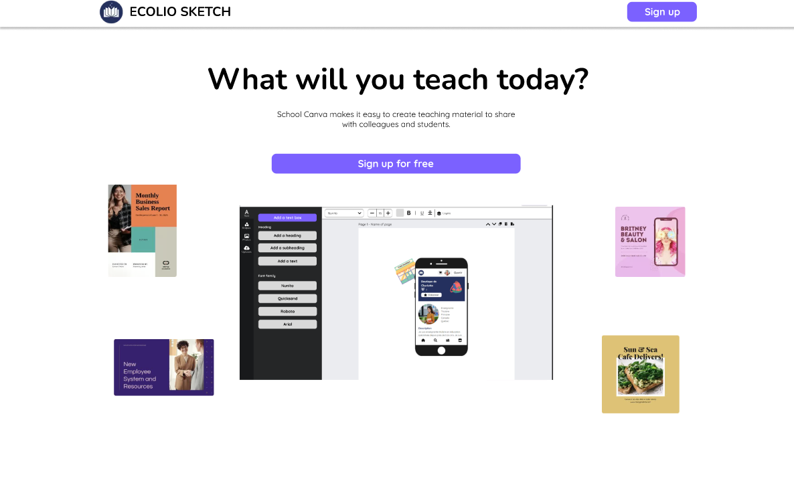
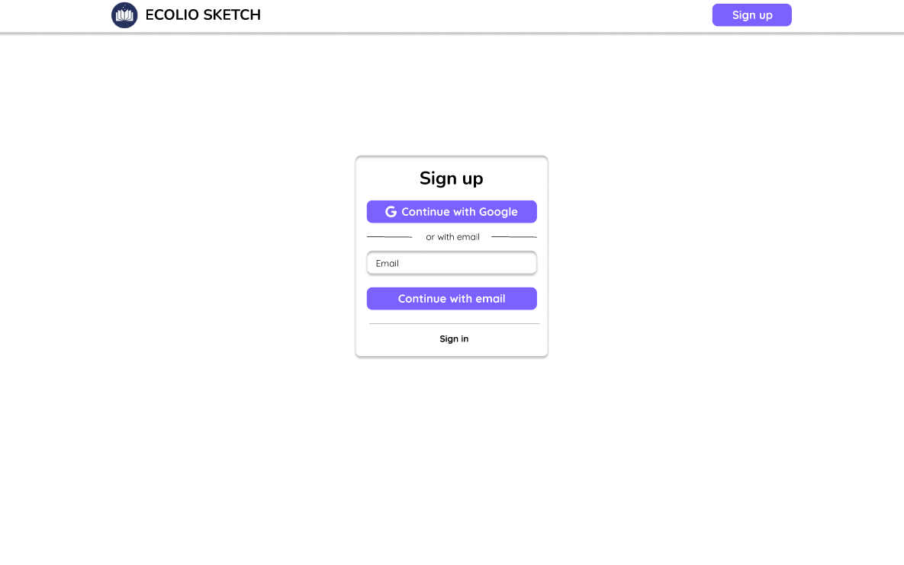
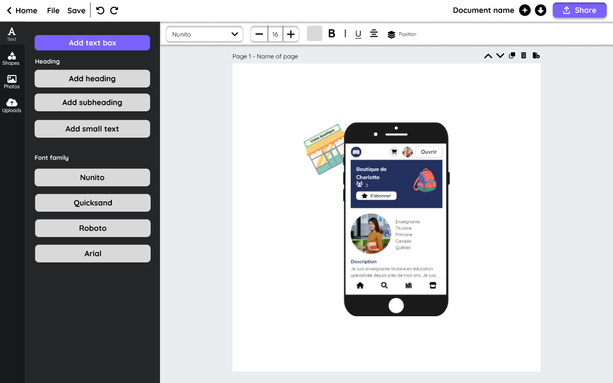
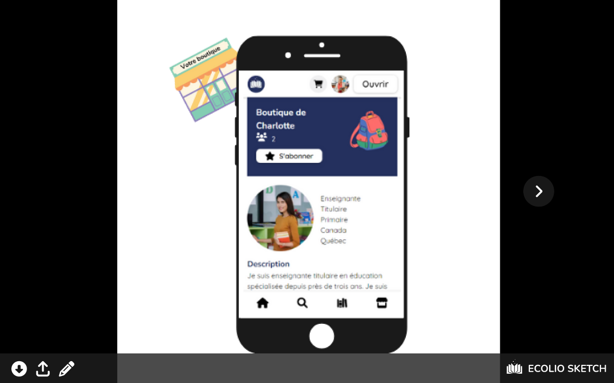

# Ecolio Sketch

## Summary

Ecolio sketch is a web application that allows teachers to create digital teaching materials to share with their colleagues and students.I am creating this app because when I was teaching, it was difficult to modify the teaching materials to the needs of my students.

## Design

[View the Figma plan](https://www.figma.com/file/YoAJ0Yuma2PPjZLO0FvwWX/Final-project?node-id=0%3A1&t=D9rtUtHTE1YAfvzk-1 "Final project Figma")

## Features

### Home page

- Image or video of the product with a short description and slogan
- Call to action: Sign up for free or Create a design (if the user login)
- Users can go to the view or create page of all his design

### Signup / Login page (with Auth0, NextAuth or Passport)
  - Continue with Google and Email

### Create page (protect page for user)
- Create a drag element: shape, text, and image
- Upload an image
- Save, share, and print the design

### View page
- Share and print the design

## APIs & Packages Used

- API
  - Auth0/NextAuth/Passport - used for authentication of users
  - Unspash - used for getting access to a collection of photos
- Packages
  - Konva - used to create and drag elements
  - Tippy - used for tooltip
  - PdfToPrinter - used to print pdf
  - Fortawesome - used for icon
  - Multer - used for uploading an image
  - Bcrypt - used for encrypting password

## Stretch Goals

- Create page
  - Customize the elements: position, color, size, etc.
  - Create a new element: question element (short and multiple)
  - Elements: duplicate and delete an element
  - Pages: add, duplicate, move, and delete a page
  - Design: Change the title and size, import a PDF, download as PDF
  - Keyboard and right click commands for everything
- View page
  - View as as a student (respond to a question)
- Class page
  - View all the answers of the students
  - Mark the students
